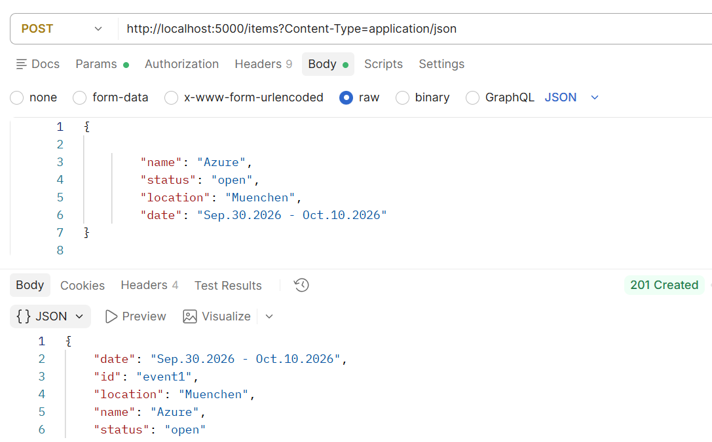
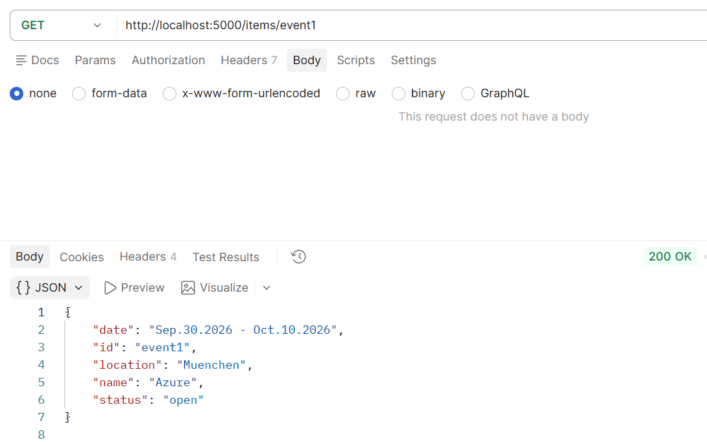
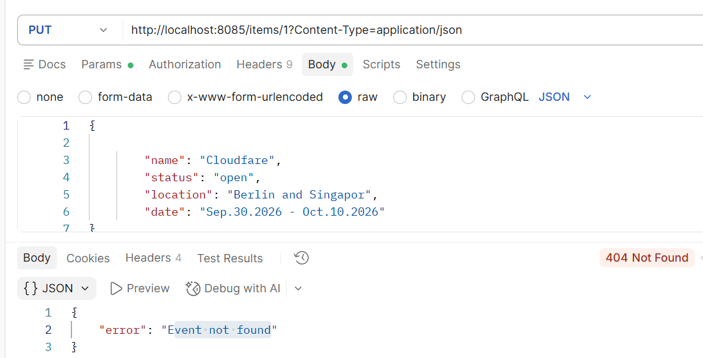
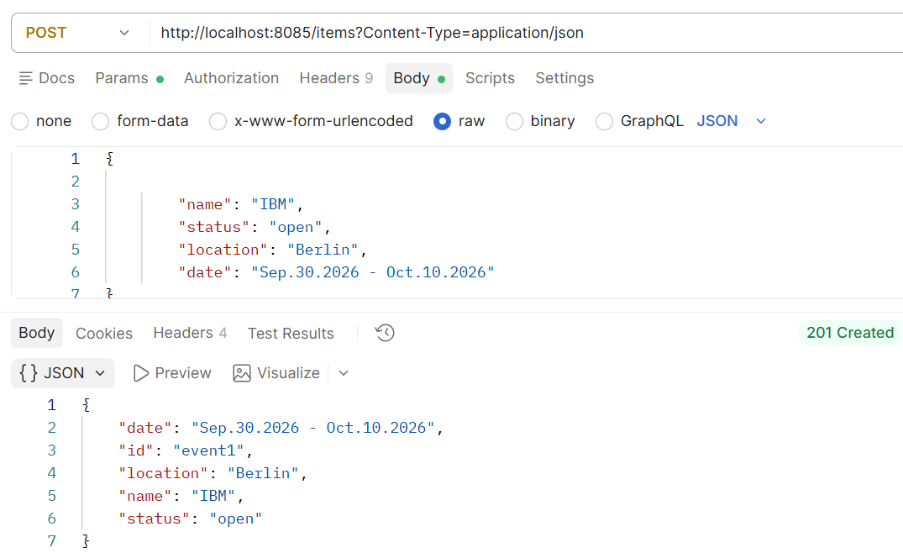
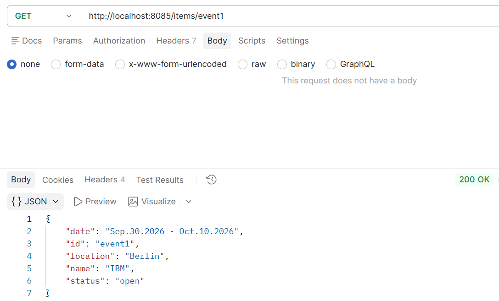
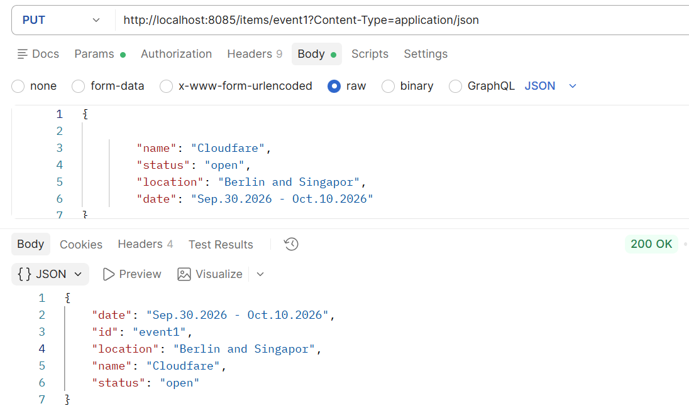
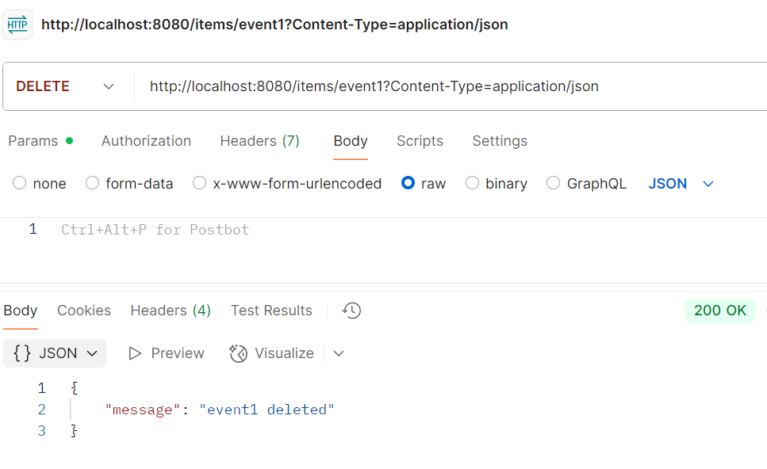

Event Planner

Short Description:

1. Selected Domain Name: 
    • Event Management Service
    • Core Entity: Event (Key fields: id, name, status, location, date)
    • Domain Boundary: Manages the lifecycle (CRUD operations) of event resources in an in-memory storage.

2. Actors
    • Event Organizer / Admin: A client or user who creates, updates, and deletes event records in the system.
    • Event Consumer / Guest User: A client or user who retrieves single or multiple event details to view scheduled events.
    • API Client / External Application: An upstream microservice or front-end consuming the REST endpoints over HTTP

|       Use Case        |  HTTP Method & Endpoint   |                          Trigger / Inputs                          |                          Success Result                           |
| :-------------------- | :------------------------ | :----------------------------------------------------------------- | :---------------------------------------------------------------- |
| Create Event      | POST `/items`             | JSON payload containing name, location, date, and optional status. | Generates ID (event1, event2), saves event, returns 201 Created.  |
| List All Events   | GET `/items`              | Request to fetch all stored events.                                | Returns a list of all event objects with HTTP 200 OK.             |
| Get Event Details | GET `/items/<item_id>`    | Route parameter `item_id` (e.g. event1).                          | Returns the event details with HTTP 200 OK (or 404 if not found). |
| Update Event      | PUT `/items/<item_id>`    | Route parameter `item_id` and JSON payload with updated fields.    | Updates existing values, preserves unset values, returns 200 OK.  |
| Delete Event      | DELETE `/items/<item_id>` | Route parameter `item_id`.                                         | Removes the event from memory, returns 200 OK confirmation.       |

1. Checking the service before docker with post 

2. checking service on the local machine and getting event by ID

Now with docker compose, 

3. Getting 404 error message, when using PUT command on a none existing file

4. POST with 201 response

5. get item by ID with 200 response

6. PUT - 200 ok message

7. Delete event by ID with 200 response 

